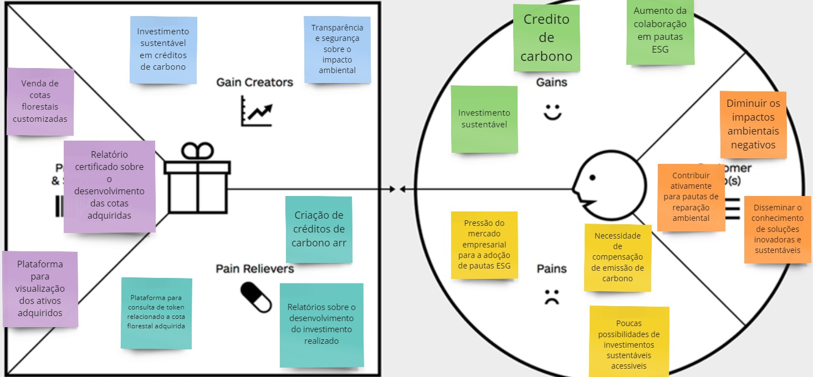

---
title: Proposta de Valor
sidebar_position: 1
--- 
# O que é a proposta de valor canvas ?
A Proposta de Valor no Canvas é a promessa de benefício que uma empresa oferece para resolver problemas ou satisfazer necessidades dos clientes, diferenciando-se da concorrência. É o que torna a oferta atraente e relevante para o público-alvo.

# Proposta de valor canvas
Para a elaboração da Proposta de Valor, foram consideradas algumas personas que são o alvo dos produtos fornecidos pela Abundance, com o objetivo de auxiliar na construção da proposta.

## Personas
- **Persona 1:** É o gestor da área de ESG e Inovação da Nomade, uma empresa responsável pela venda de artigos de moda. Com a intenção de reduzir a emissão de carbono produzida pela empresa, ele decide adquirir um plano de 10.000 árvores em nome da empresa. Assim, além de diminuir sua pegada de carbono ao longo dos anos com os créditos gerados, a empresa pode aumentar sua participação em pautas ESG e investimentos sustentáveis.

- **Persona 2:** É a pessoa física que deseja realizar um investimento sustentável. Com um investimento de capital menor, ela busca obter ganhos futuros e contribuir para o desenvolvimento de soluções inovadoras e sustentáveis.

## Canva finalizado

## Conclusões
A solução desenvolvida através do projeto permitirá a criação de relatórios mais precisos e customizáveis para cada cliente, além de incorporar mais tecnologia à solução desenvolvida, aumentando seu valor agregado como investimento potencial. Portanto, a utilização de um modelo de visão computacional que possa ser implementado em um dispositivo embarcado, através de uma arquitetura baseada em preceitos de computação de borda, será fundamental para a evolução do produto.
