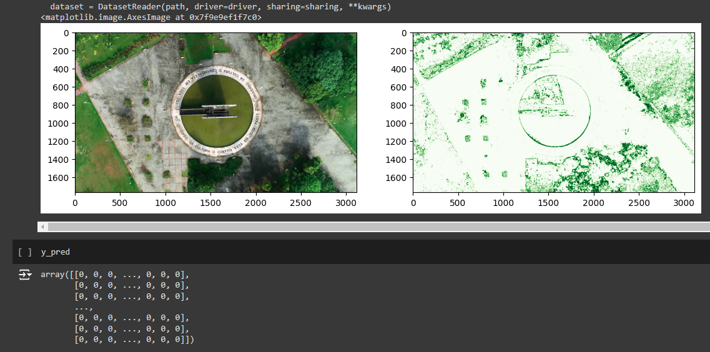
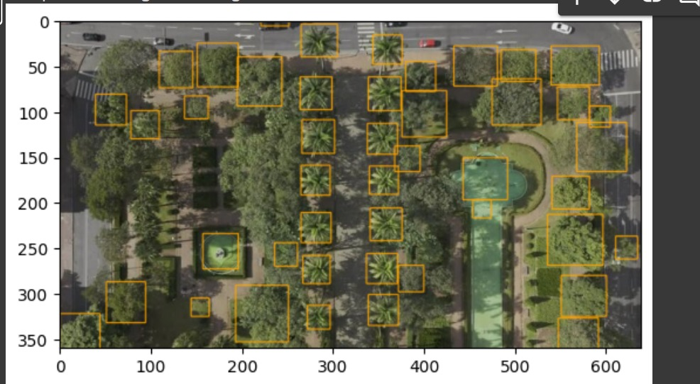
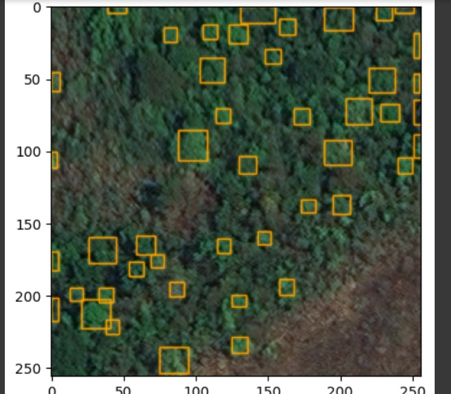
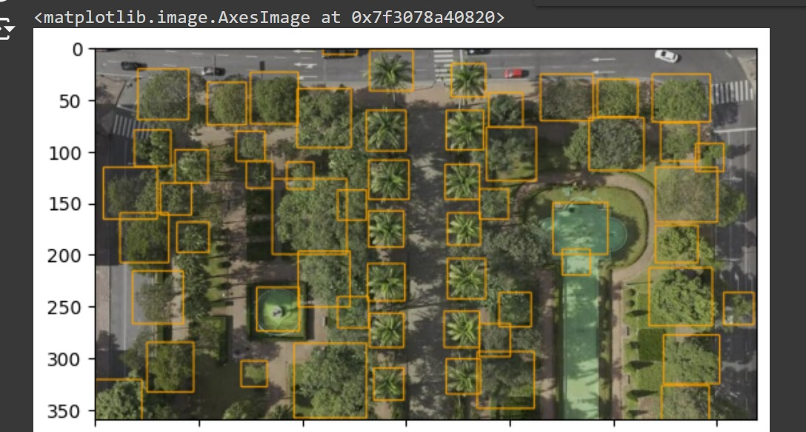
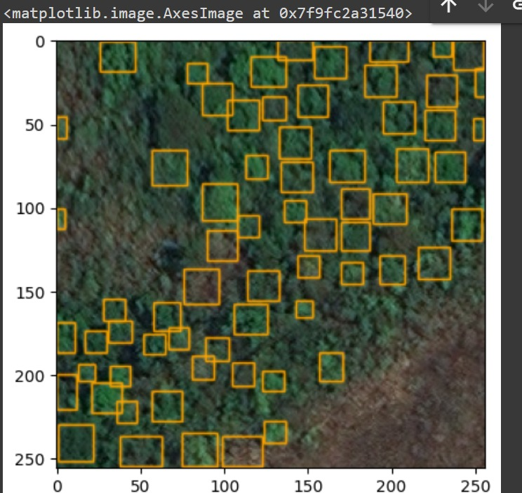

# Documentação de teste feito com os modelos selecionados
- Para o desenvolvimento dessa sprint, foi pensado em como unir os principais pontos fortes dos modelos pesquisados e contornar suas limitações para obter um resultado melhor.

## Hipótese de teste 
- No início do desenvolvimento, a primeira hipótese levantada foi como utilizar o modelo Detectree para classificar, em uma imagem, o que é árvore ou não, e usar sua saída para complementar o treinamento do Deep Forest, que realiza a criação de bounding boxes em árvores, identificando-as individualmente e gerando o resultado desejado para uso no projeto.

## Primeiros passos
- O Detectree utiliza como entrada uma imagem e, com a saída do resultado da classificação do modelo, ele devolve uma matriz com os dados de todos os pixels daquela imagem, classificando em 0 pixels que não são relacionados a árvores na imagem e 255 para pixels que são árvores. Assim, podemos utilizar essa matriz como entrada para o treinamento do modelo Deep Forest.

## Deep forest 
- Para retreinar o Deep Forest, é possível passar um arquivo .csv com dados sobre a imagem: **x máximo**, **x mínimo**, **y máximo**, **y mínimo** e o label como **Tree**. Assim, para o uso da saída do Detectree, foi necessário realizar alguns tratamentos na matriz de saída para que fosse criado um arquivo .csv que pudesse ser utilizado no Deep Forest como parâmetro de treinamento.

## Tratamento da matriz
- Para a criação do arquivo .csv, foi utilizado um tratamento para agrupar os pontos em que o Detectree identificou como árvore e, através do uso de um número arbitrário, foi criado um parâmetro para a definição de x e y máximos e mínimos para aquele agrupamento de pontos, gerando assim uma linha referente à posição de uma possível árvore na imagem. Após esse tratamento, é gerado um .csv com várias linhas referentes às coordenadas dos pixels em que existe uma árvore naquela imagem.

## Retreinameto do Deep Forest 
- Por fim, foi criado um novo trainer para o Deep Forest utilizando como entrada o .csv gerado e, após 10 épocas de treinamento, foi notável a melhoria nas classificações do modelo em relação ao que é uma árvore individualmente.

### Imangens sem o retreinamento com saida do Detec Tree

### Imangens com o retreinamento com saida do Detec Tree

## Limitações 
- Durante os testes, foram notáveis alguns fatores que limitam a aplicação deste método de maneira geral para diferentes tipos de imagens.

### Resolução da imagem 
- Uma das primeiras limitações perceptíveis foi em relação à resolução da imagem utilizada no treinamento, pois, a princípio, foi utilizada uma imagem de baixa resolução para a construção do tratamento. Contudo, caso seja utilizada uma imagem com resoluções mais altas, a matriz de saída do Detectree se torna exponencialmente maior, devido ao aumento da quantidade de pixels referentes a uma única árvore. Portanto, isso implica que os parâmetros de agrupamento e bounding box precisam ser dinâmicos para se ajustar à resolução da imagem, tendo em vista que a relação é diretamente proporcional para os três: quanto maior a resolução, maior o agrupamento e maior o tamanho do bounding box.

### Treinamento do deep forest.
- Contudo, a primeira limitação está diretamente ligada ao treinamento do Deep Forest, que, por ser um modelo robusto com aproximadamente 30 milhões de parâmetros, quanto maior a quantidade de linhas que o .csv possui, maior é o custo de memória para o treinamento. Para um exemplo comparativo, uma imagem de 250 x 250 pixels com um agrupamento de 9 pixels adjacentes gera aproximadamente 5000 linhas no arquivo .csv. Já uma imagem de 3000 x 1600 pixels, com um agrupamento de 27 pixels, gera aproximadamente 100 mil linhas para o arquivo .csv. Tendo em vista que só foi possível treinar o modelo com 5000 linhas até que ele atingisse o pico de memória RAM de 50 GB, essa se torna uma limitação relevante, que encadeia com outro problema.

### Perda de informação X performance 
- Como foi dito na última limitação, o número de agrupamentos de pixels adjacentes para a criação de um ponto de coordenadas que será uma linha do .csv é um fator de muita relevância para o treinamento do Deep Forest, tendo em vista que esse agrupamento carrega as informações do Detectree. Ainda não foi possível metrificar o quanto o agrupamento de muitos pontos pode interferir na melhora ou piora do treinamento do modelo, mas é lógico pensar que, quanto maior a perda de informações, menos precisos serão os dados de suporte para o treinamento. Esse é o principal problema que pretendemos resolver.