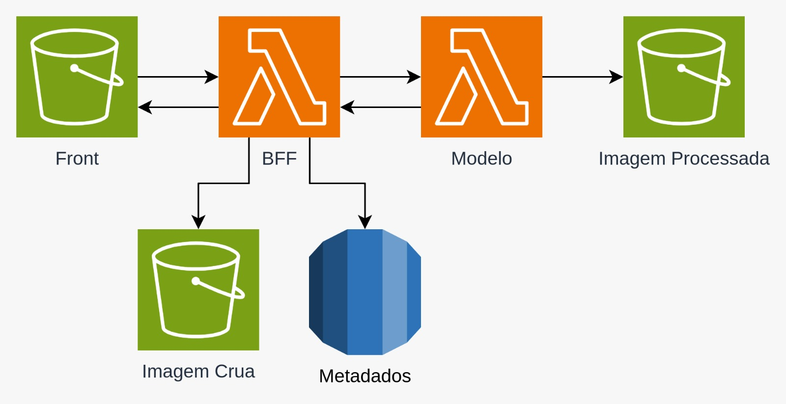

# Arquitetura Cloud e Primeiras Implementações

Especificamos a arquitetura e fluxo de informações na Cloud, que nosso projeto usará

## Arquitetura

- **Bucket S3**
    
    Uma instancia S3 com 3 pastas de armazenamento, uma para o Frontend, e duas outras para versões da imagem upada, a original e a processada

- **Lambda**

    O sistema conta com 2 funções Lambda. 
    
    A primeira, **Backend For Frontend (BFF)**, é acionada após o envio da imagem em conjunto com as informações inputadas pelo Usuario. Ele salva a imagem no Bucket "Raw Image" (Imagem Crua) e as informações inputadas no RDS "Metadados". O BFF então envia a url da imagem no bucket para a próxima função Lambda, o Modelo.

    O **Modelo** irá consumir a imagem através da URL, e rodar o modelo, aplicando as transformações necessárias. A imagem processada, o output do modelo, será salvo no Bucker "Processed Image" (Imagem Processada).

- **RDS**

    Nosso banco de dados em Postgrees está hospedado no RDS, que vai armazenar primeiro as informações inputadas pelo usuario e depois as informações geradas pelo modelo, como o numero de arvores na 
    

