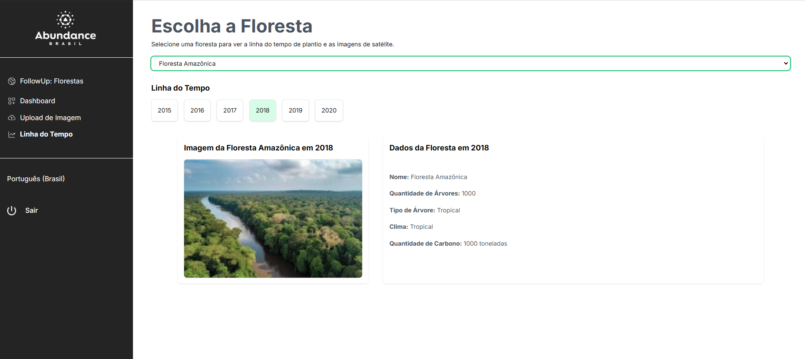

# Funcionalidades da Aplicação

A aplicação web foi desenvolvida com **Next.js** e estilizada utilizando **TailwindCSS**. Ela contém as seguintes funcionalidades principais:

## 1. Tela de Login e Cadastro

A tela de login e cadastro permite que o usuário crie uma conta e faça login no sistema. Ao se registrar, o sistema armazena suas credenciais, e ao realizar login, o usuário é autenticado no backend, ganhando acesso às demais funcionalidades da aplicação.

---

## 2. Dashboard de Visualização de Dados

A dashboard apresenta informações relevantes sobre as florestas monitoradas, incluindo:

- Quantidade de árvores vivas e mortas.
- Número total de árvores em uma floresta ao longo do tempo.
- Registros de árvores por meio de fotografias e contagem automática de árvores.

Essa funcionalidade dá ao usuário uma visão geral da saúde das florestas, além de acompanhar mudanças e tendências ao longo do tempo.

---

## 3. Página de Upload de Imagem

Nesta página, o usuário pode fazer o upload de uma imagem de uma floresta para ser processada. Além disso, é possível preencher um formulário com informações adicionais, como o nome da floresta e a data da captura da imagem. Após o envio, a imagem será analisada pelo sistema para identificação e contagem das árvores.

---

## 4. Página de Visualização das Florestas ao Longo do Tempo

A página de visualização permite que o usuário selecione uma floresta e visualize suas imagens ao longo dos anos. Um seletor de anos possibilita a comparação das condições da floresta em diferentes períodos, junto com informações detalhadas sobre cada ano.

---

Com essas funcionalidades, a aplicação facilita o monitoramento de florestas e o acompanhamento de mudanças ao longo do tempo, fornecendo uma interface simples e eficiente para gerenciar os dados de conservação ambiental.
